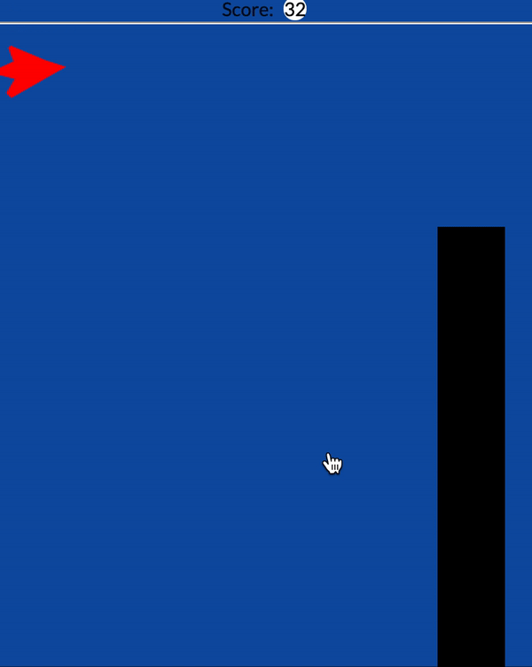

# hackathon-game

## Description

This SERN (MySQL, Express, React, Node.js) stack game application is our entry to the Mintbean Junior Web Dev Hackathon.

## Table of Contents

- [Installation](#installation)

- [Usage](#usage)

- [Contributing](#contributing)

- [Tests](#tests)

- [License](#license)

- [Questions](#questions)

## Installation

Installation requirments to run locally include Node.js, React.js, Express.js, Cors, MySQL/Sequelize.

## Usage

Upon launching the game, simply fly your plane (by using mouse clicks) through the openings in the blocks!

)

## Contributing

Please feel free to contribute to future versions of this game!

## Tests

No testing has been utilized for version 1.0

## License

This project is covered under the MIT license.

## Questions

Please reach out to me with any questions at hutsonwood@gmail.com or nbrailsford@msn.com. You can also check out our other projects at https://github.com/LHWOOD and https://github.com/nbrailsford
